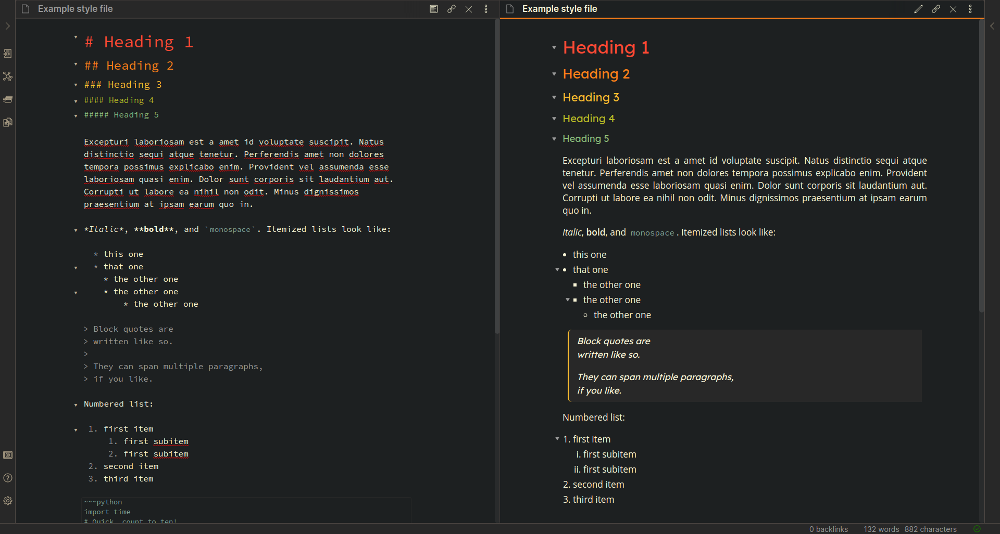

# Obsidian + gruvbox alternative

This is my take on the [Obsidian gruvbox style by insanum](https://github.com/insanum/obsidian_gruvbox). I wanted larger fonts and more contrast (you can guess why), but ended up making small cosmetic changes. The graph view is the default one. List of changes [here](#changes).

## Changes

- More contrast (darker background, brighter fonts)
- Larger font sizes for editor and preview base-text
- Justified text in Preview Mode
- A prettier block quote
- multiple changes to numbered and bullet lists
  - added spacing to keep them a little separate from the rest of the text
  - added spacing between list items
  - use of different list styles for nested lists
- added padding to bullet and numbered lists
- Different font faces:
  - [Lexend](https://www.lexend.com/) Deca for titles in Preview Mode
  - [Open Sans](https://fonts.google.com/specimen/Open+Sans)/[Oxygen](https://fonts.google.com/specimen/Oxygen)/[IBM Plex Sans](https://fonts.google.com/specimen/IBM+Plex+Sans) for text in Preview Node
  - [B612 Mono](https://hail2u.github.io/mn/b612-mono/) for edit mode
